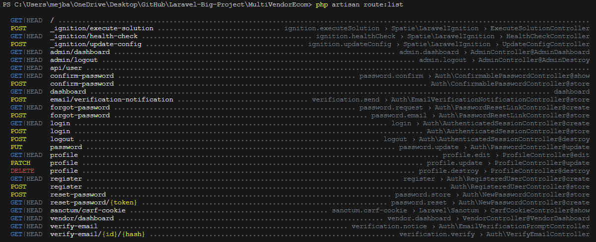

এবার আমরা এডমিন লগআউট ফাংশানালাটি যুক্ত করবো। আমরা যেহেতু আমাদের ফাইলে পার্ট বাই পার্ট আলাদা করেছে এখন লগ আউট অংশটি হেডার অংশে পড়েছে তাই হেডার অংশে গিয়ে পরিবর্তন করতে হবে। সেখানে গিয়ে আমরা লগআউট এরিয়াতে `<a class="dropdown-item" href="javascript:;"><span>Logout</span></a>` এই কোর্ড এ গিয়ে এই `{{ route('admin.logout') }}` টি যুক্ত করবো। এবং web.php ফাইলে `Route::get('/admin/logout', [AdminController::class, 'AdminDestroy'])->name('admin.logout');` এই রাউটটি যুক্ত করবো। আমরা `php artisan route:list` এই artisan কমান্ডটি দিয়ে ডিফল্ট রাউট লিস্ট দেখি তবে দেখবো অলরেডি logout নারে একটি রাউট আছে যার লিঙ্ক `logout › Auth\AuthenticatedSessionController@destroy` ও আমাদের ঐ কামান্ড এর মাধ্যমে দেখাবে । 

ঐ লিঙ্কে গেলে সেখানে আমরা এর জন্য destroy মেথডটি দেখতে পারবো এটিকে কাট করে আমি AdminController এ যুক্ত করে দিয়েছি

```php
public function destroy(Request $request): RedirectResponse {
        Auth::guard('web')->logout();

        $request->session()->invalidate();

        $request->session()->regenerateToken();

        return redirect('/');
    }
```

কিন্তু যেহেতু রাউটটে আমরা মেথডের নাম AdminDestroy ব্যবহার করেছি তাই এটিকে রিনেইম করে নিলাম।

```php
public function AdminDestroy(Request $request): RedirectResponse {
        Auth::guard('web')->logout();

        $request->session()->invalidate();

        $request->session()->regenerateToken();

        return redirect('/');
    }
```

এবং এটি ব্যবহার করার জন্য প্রয়োজনিয় ক্লাস গুলো ইমপোর্ট করে নিবো।

```php
use Illuminate\Http\RedirectResponse;
use Illuminate\Http\Request;
use Illuminate\Support\Facades\Auth;
```

### একটি বিষয় লক্ষ করলে দেখা যাবে এক জন ইউজার সাধারণ ইউজার হোক বা এডমিন হোক বা ভেন্ডর হোক তাদের অবশ্যই লগিং করতে হয় এর জন্য লগিং এর জন্য আমি আলাদা একটি রাউট তৈরি করে নি। `Route::get('/admin/login', [AdminController::class, 'AdminLogin']);` এটিকে কাজ করানোর জন্য কন্ট্রোলারে AdminLogin মেথডটি যুক্ত করি।

```php
 public function AdminLogin() {
        return view('admin.admin_login');
    }
```

এই মেথডে ব্যবহৃত admin_login ফাইলটি আমরা এখন তৈরি করে নি admin_login.blade.php নামে এডমিন ফোল্ডার এর ভেতরে তৈরি করলাম। এখন আমরা এই পর্যন্ত লগিং করার জন্য যে পেইজটি ব্যবহার করছি সেটি হচ্ছে auth ফোল্ডার এর ভেতরের login.blade.php ফাইল যা আমরা breez ইনস্টল করার সময় বিল্ট ইন ভাবে পাই এখন সেই ফাইলের কোড গুলো পুরো কপি করে আমাদের নতুন তৈরি করা ফাইলে পেস্ট করি পরবর্তিতে আমরা এটিকে নিজের মতো কাস্টমাইজ করবো।

একটু পূর্বে আমরা যে AdminDestroy মেথড তৈরি করেছি সেখালে লগআউট করার পরে `return redirect('/');` এর মাধ্যমে হোম পেইজ এর ঠিকানা তে রিডাইরেক্ট করেছি কিন্তু এখন আমরা সেটিকে পরিবর্তন করে `/admin/login` পেইজে দিয়ে দি `return redirect('/admin/login');` ।

### এবার আমরা /admin/login পেইজ টিকে আমাদের থিম দিয়ে কাস্টমাইজ করবো । এর জন্য আমি আমার authentication-signin.html ফাইলটি ব্যবহার করবো । তাই এই ফাইলের সমস্ত কোর্ড `/admin/login` ফাইলে পেস্ট করবো তবে তার পূর্বে এই ফাইলটির কোড অন্য কোথাও সেইভ করতে হবে যাতে এর কিছু প্রোপার্টি আমরা ব্যবহার করতে পারি। এবার প্রথমেই পেইজটির assets গুলো ঠিক করে নি। তার পর এখন আমাদের কাজ হচ্ছে আমাদের পূর্বের /admin/login অনুসারে এর কিছু সিটিং ঠিক করে নি। আমরা প্রথমেই ফর্ম সেকশনে চলে যাই ।

এখানে আমাদের নতুন ফাইলে পূর্বের পাইলের এই অংশটি কপি করে

```php
<form method="POST" action="{{ route('login') }}">
        @csrf
```

নতুন ফাইলের <div class="form-body"> এর নিচে যুক্ত করি এবং নতুন ফাইলের <form class="row g-3"> এখান থেকে ক্লাসটি আমরা ব্যবহার করি

 <form class="row g-3" method="POST" action="{{ route('login') }}">
 @csrf
```
সর্বশেষে <form class="row g-3"> কে ডিলিট করে দি। এখন এখানে প্রায় সবই ঠিক আছে শুধু আমাদের ফর্ম এর input গুলোতে পূর্বের সাথে মিলিয়ে কিছু পরিবর্তন করতে হবে।

আমাদের এখানে email ও password ইনফুট ফাইলে শুধু type, type ও id দুটির ই পরিবর্তন করি। পূর্বের টির মতো। পাসওয়ার্ড ফিল্ড থেকে ভেলু বাদ দিয়ে দিবো।

```php
<input type="email" name="email" class="form-control" id="email" placeholder="Email Address">
<input type="password" name="password" class="form-control border-end-0" id="password" placeholder="Enter Password">
```

এখন সবকিছু সুন্দর মতো কাজ করবে।
